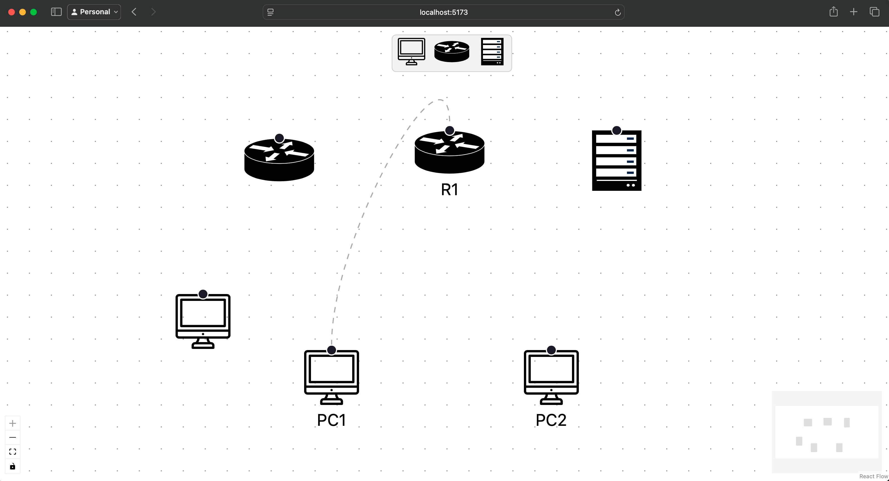

# Interactive Canvas Web Application with React Flow

This project demonstrates how to build an **interactive canvas web application** using [React Flow](https://reactflow.dev/). 
The application allows users to create network topology diagrams with draggable nodes, customizable edges, and a toolbar for adding new nodes. 
It serves as a foundation for building more advanced node-based editors, such as workflow editors, data pipelines, or network visualizations.

For a detailed guide on how this application was built, check out my Medium article - [Creating an Interactive Canvas Web Application](https://jurajmaj.medium.com/creating-an-interactive-canvas-web-application-370169aa5de8)

## Features

- **Custom Nodes**: Includes custom nodes for different network devices (Router, PC, Server) with SVG icons.
- **Drag-and-Drop Toolbar**: A toolbar with draggable icons to add new nodes to the canvas.
- **Interactive Canvas**: Supports zooming, panning, and connecting nodes with edges.

## Getting Started

To get started, clone the repository and install the dependencies:

```bash
npm install # or `pnpm install` or `yarn install`
```

You can start a development server with:

```bash
npm run dev
```

While the development server is running, changes you make to the code will be
automatically reflected in the browser!

## Things to try:

- Add a new node to the canvas by dragging an icon from the toolbar.
- Connect nodes by dragging from one node to another.
- Delete a node by selecting it and pressing the `Delete` key.
- Customize the node types, edge styles, and toolbar icons.

## Resources
- [Medium Article - Creating an Interactive Canvas Web Application](https://jurajmaj.medium.com/creating-an-interactive-canvas-web-application-370169aa5de8)
- [React Flow - Docs](https://reactflow.dev)

## Credits:
- [Source of PC Icon](https://www.reshot.com/free-svg-icons/item/computer-EBZSHLPRTA/)
- [Source of Router Icon](https://vecta.io/symbols/240/cisco-network-topology-icons-3015/204/router)
- [Source of Server Icon](https://vecta.io/symbols/62/cisco-security-stealthwatch/19/server)
